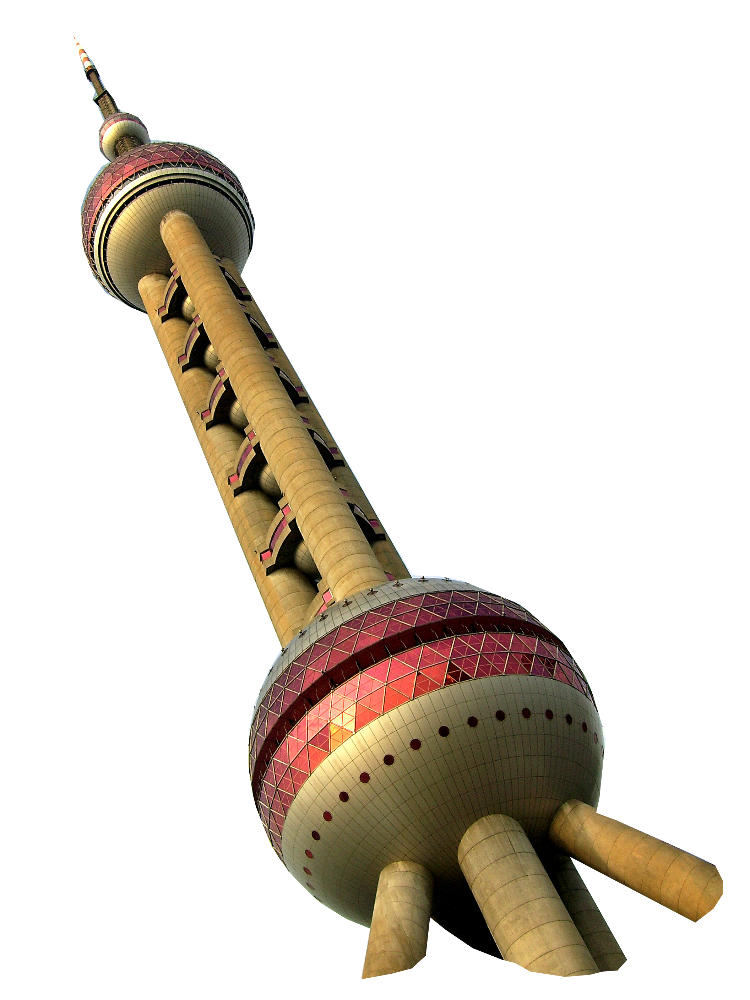

    <h1>About us</h1>
    
How Williamsburg coffee came to Shanghai

 

  <h2>Williamsburg coffee roasted in Shanghai</h2>
  
Specialty coffee was born in Williamsburg, New York. Williamsburg Coffee Roasters, now based in Shanghai aim to bring specialty coffee and culture to this city. Importing Q graded green bean Single-Origins from around the world, we then roast locally and on demand.

	<h2>Serving selected venues</h2>
  
Selling to various restaurants, cafés and hotels in Shanghai we create distinct premium blends that adapt to consumer taste. We also specialize in supplying/renting coffee machines, coffee machine maintenance and staff training. Contact us below for your personalized coffee package.

  

