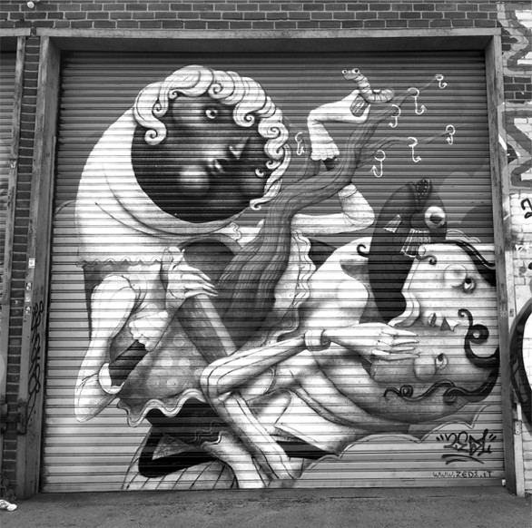

#Where it all started

##Our history

Specialty coffee was born in Williamsburg, New York. Williamsburg Coffee Roasters, now based in Shanghai aim to bring specialty coffee and culture to this city. Importing Q graded green bean Single-Origins from around the world, we then roast locally and on demand. 

Selling to various restaurants, cafés and hotels in Shanghai we create distinct premium blends that adapt to consumer taste. We also specialize in supplying/renting coffee machines, coffee machine maintenance and staff training. Contact us below for your personalized coffee package. 

