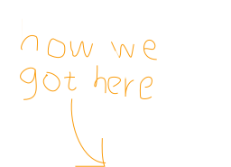

<!-- glo labels  -->

  

<!-- miss shanghai labels -->

  

<!-- streetart image-->

  

<!--  polaroid image -->

  

    <h1>Welcome to Williamsburg</h1>
    
Roasters of single origin coffee for selected venues in Shanghai

    <!-- <h3>- The Willyburg Clan -</h3>
    
    
    
    
    
     -->

 

  

    
  

  

    <h2>Customized bakery blend for Glo London</h2>
    
We created an exclusive packaging design and espresso blend, whilst trying to maintain their brand image. Also revamped their drinks menu with some quality signature drinks and coffee cocktails. The blend will be used in their restaurants and will be retailing in 250g tins throughout their bakery shops. Check out their website for info on their location in China. Please visit <a href="http://www.glolondon.com">glolondon.com</a> for more information.

  

  

    <h2>Miss Shanghai Blend & Coin Qian Collection</h2>
    
Limited edition Miss Shanghai Blend. Teamed up with artist Coin Qian (<a href="http://www.coinqian.com">coinqian.com</a>) from Xun Mi Café + Gallery (541 Yuyuan Lu, house 30) to create a colourful packaging design that revives flavours from Shanghai’s flamboyant past. The blend is a mixture of Colombian, Honduran and Guatemalan single-origins roasted at a med-high level reveals hints of caramel, amaretto and almondy goodness. Miss shanghai is supplied and sold to these places:
       Lis cafe & restaurant on Dagu lu number 388 
    Xun Mi cafe & gallery on Yuyuan lu number 541, house number 30
   Axis cafe & bakery on South Huangpi lu number 720

  

  <h1>About us</h1>
  
How Williamsburg coffee came to Shanghai

 

  

    
  

  

    <h2>Williamsburg coffee roasted in Shanghai</h2>
    
Specialty coffee was born in Williamsburg, New York. Williamsburg Coffee Roasters, now based in Shanghai aim to bring specialty coffee and culture to this city. Importing Q graded green bean Single-Origins from around the world, we then roast locally and on demand.

  

  

    <h2>Serving selected venues</h2>
    
Selling to various restaurants, cafés and hotels in Shanghai we create distinct premium blends that adapt to consumer taste. We also specialize in supplying/renting coffee machines, coffee machine maintenance and staff training. Contact us below for your personalized coffee package.

  

