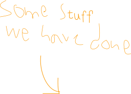

  

<!-- 

  

 -->

  

<!-- 

  

 -->

    <h1>Welcome to williamsburg</h1>
    
Roasters of single origin coffee for selected venues in Shanghai

 

  

    
  

  

    <h2>Customized bakery blend for Glo London</h2>
    
We created an exclusive packaging design and espresso blend, whilst trying to maintain their brand image. Also revamped their drinks menu with some quality signature drinks and coffee cocktails. The blend will be used in their restaurants and will be retailing in 250g tins throughout their bakery shops. Check out their website for info on their location in China. Please visit <a href="http://www.glolondon.com">glolondon.com</a> for more information.

  

  

    <h2>Miss Shanghai Blend & Coin Qian Collection</h2>
    
Limited edition Miss Shanghai Blend. Teamed up with artist Coin Qian (<a href="http://www.coinqian.com">coinqian.com</a>) from Xun Mi Café + Gallery (541 Yuyuan Lu, house 30) to create a colourful packaging design that revives flavours from Shanghai’s flamboyant past. The blend is a mixture of Colombian, Honduran and Guatemalan single-origins roasted at a med-high level reveals hints of caramel, amaretto and almondy goodness. Miss shanghai is supplied and sold to these places:
       Lis cafe & restaurant on Dagu lu number 388 
    Xun Mi cafe & gallery on Yuyuan lu number 541, house number 30

  

