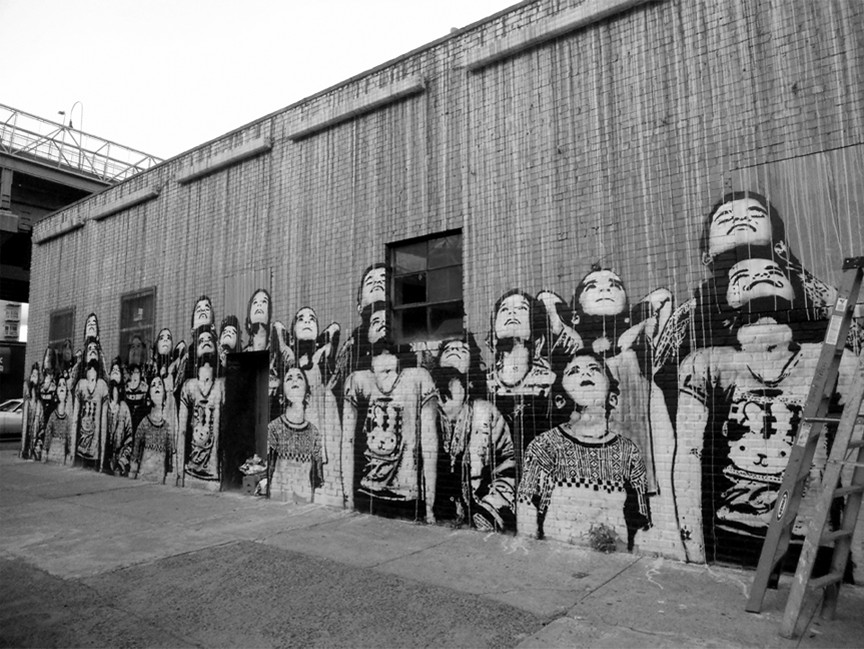
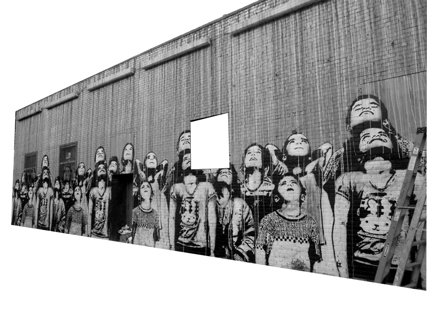
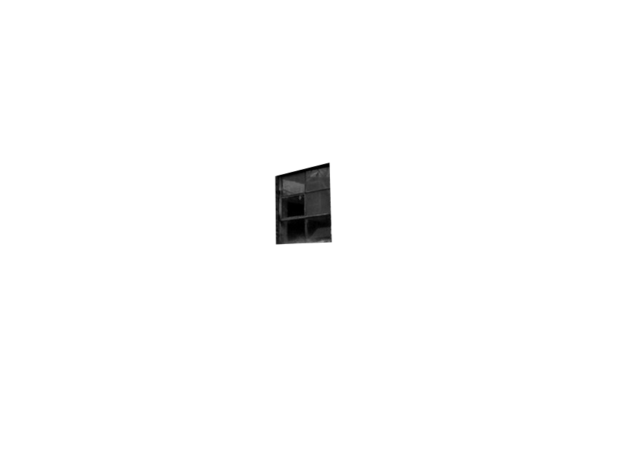
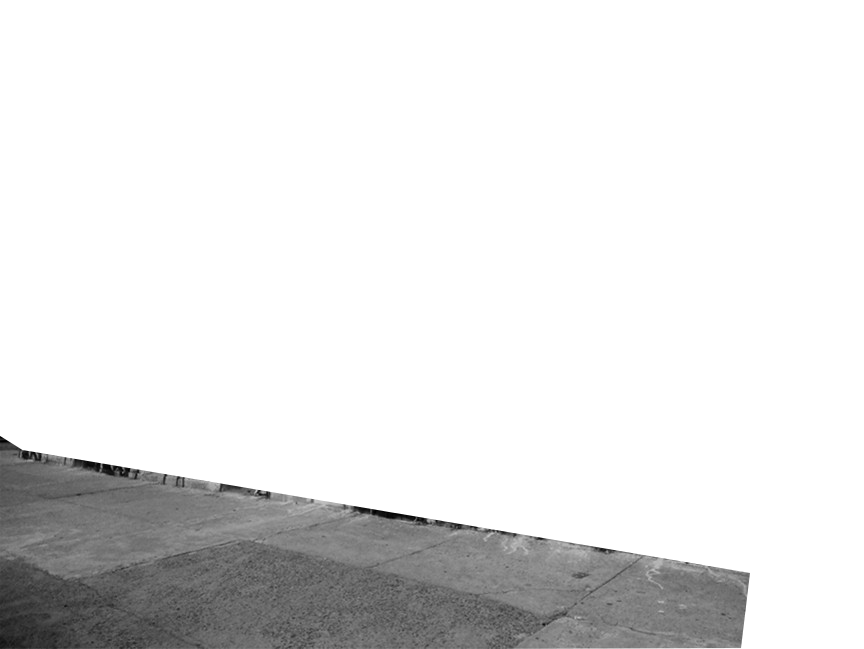
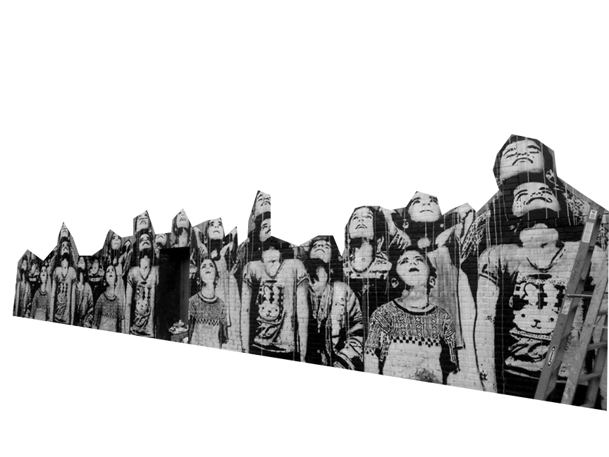

<ul id="scene">
  <!-- <li class="layer" data-depth="0.10"></li> -->
  <!-- <li class="layer" data-depth="0.30"></li> -->
  <li class="layer" data-depth="0.20"></li>
  <li class="layer" data-depth="0.50"></li>
  <li class="layer" data-depth="0.50"></li>
  <li class="layer" data-depth="0.40"></li>
  <li class="layer" data-depth="0.80"></li>
  <li class="layer" data-depth="0.60"></li>
  <!-- <li class="layer" data-depth="0.40"></li> -->
  <li class="layer" data-depth="0.00">
  	

  		<h1>Welcome to williamsburg</h1>
  		<h2>Distributor of single origin coffee to selected venues in Shanghai</h2>
  	<!-- 	The finest coffees in the world, now roasted in Shanghai. Williamsburg first started roasting coffee in Caroll Gardens in 1948 and since then the township of Williamsburg, in Brooklyn New York, has seen coffee roasting flourish until today when there are 20 different companies roasting coffee. Williamsburg Coffee Roasters are now bringing speciality coffee to Shanghai and offering some of the finest and highest Q-grade coffees in China. Only the best coffees with Q grades above 80 have been selected for consideration to be part of the Williamsburg collection. -->
  	

  </li>
</ul>

