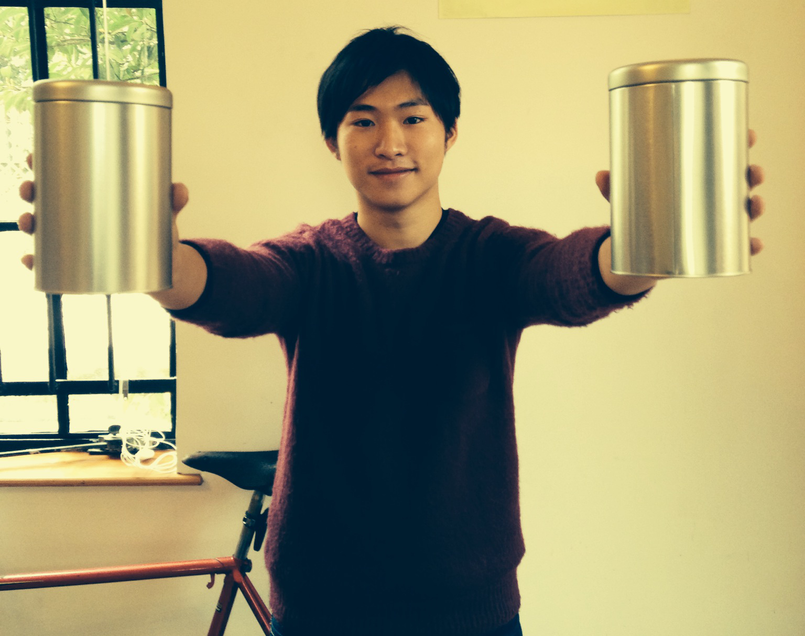
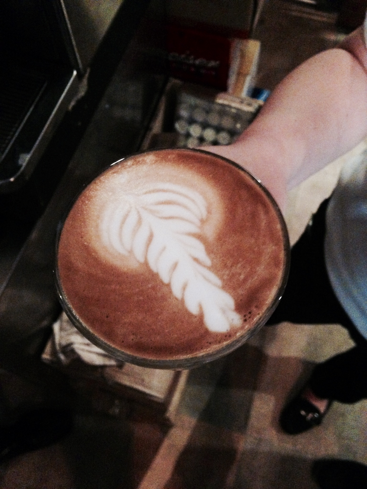
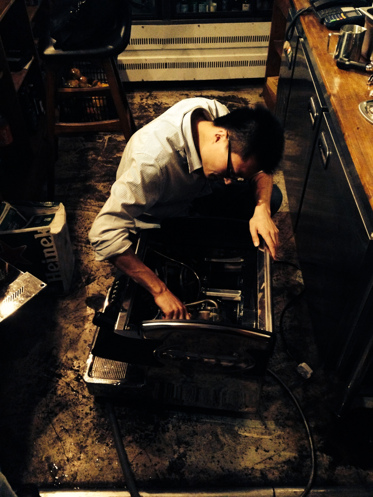

<!-- 
 -->
<!-- 

 -->

	<h1>Experts in coffee</h1>
	<h2>assisting you all the way from bean to cup</h2>

  

    
  

	<ul class="icon-group-big">
		<li>
			</i>
			<h3>wholesale</h3>
		</li>
		<li>
			</i>
			<h3>training</h3>
		</li>
		<li>
			</i>
			<h3>events</h3>
		</li>
		<li>
			</i>
			<h3>maintenance</h3>
		</li>

	

		

			<h1>wholesale products</h1>
			<h2>single origin coffee and special blends</h2>
			
Strictly sourcing Q-graded Single-Origins from around the world, maintains the quality that we strive for in every cup. We freshly roast signature Single-Origins and have our premium blends created for local tastes. Our wholesale beans are delivered within 24 hours after roasting. Contact us for price information.

		

		

			
		

	

	

		

			
		

		

			<h1>Barista training</h1>
			<h2>Let us show you the ropes</h2>
			
From preparation to all-around coffee knowledge to professional barista techniques - and learning along the way. To share what we know, we put together straightforward instructions for our favorite home brewer, collected an ever-expanding range of coffee information, and designed an expansive curriculum. Our hands-on training comprises engaging and informative weekly public tastings to comprehensive curriculum and certifications for coffee proffesionals.

		

	

	

		

			<h1>events at your venue</h1>
			<h2>we bring coffee lovers to you</h2>
			
contact us if you want us to arrange a coffee tasting event at your venue!

		

		

			
		

	

	

		

			
		

		

			<h1>maintentance for your coffee equipment</h1>
			<h2></h2>
			
when you rent or buy equipment from us you don't have to worry about anything.

		

	

